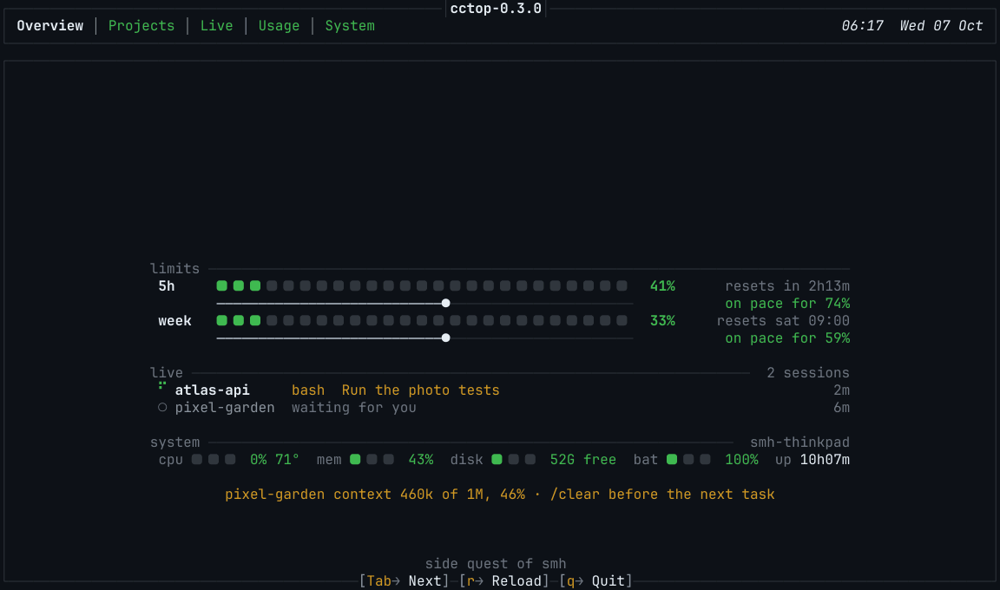
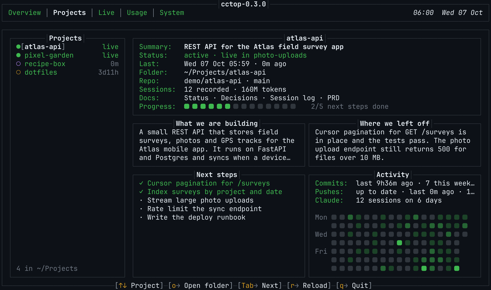
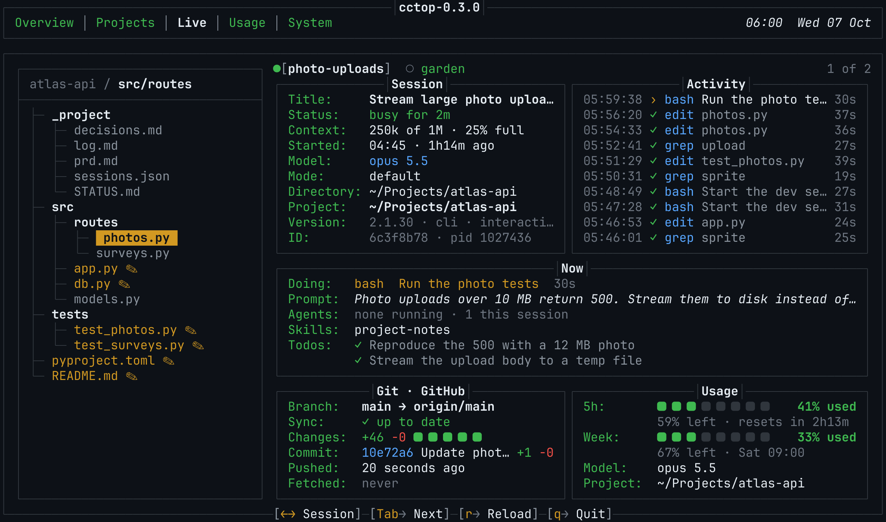
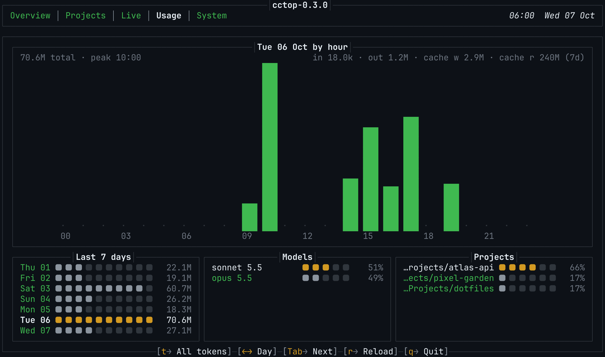
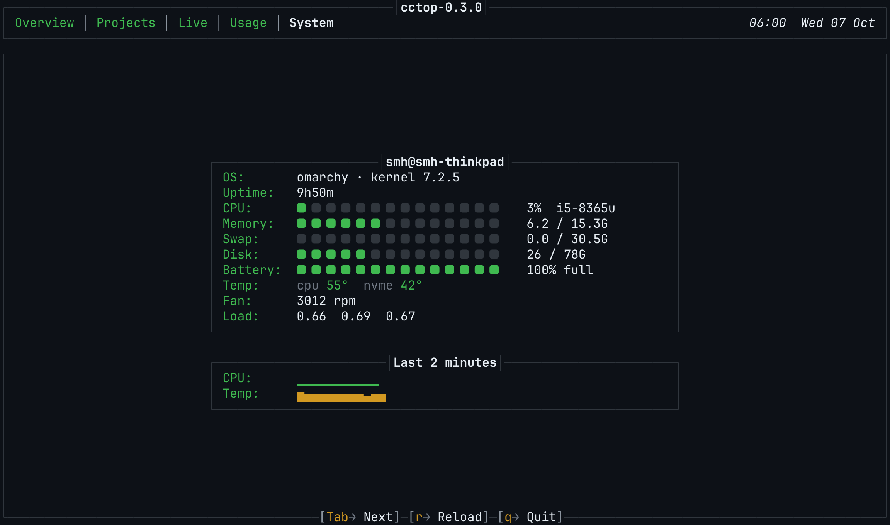

<p align="center">
  
</p>

<h1 align="center">cctop</h1>

<p align="center">
  A terminal dashboard for Claude Code on Linux.<br>
  Plan limits, token usage, live sessions, your projects and the health of your machine, in one place.
</p>

<p align="center">
  <a href="#install">Install</a> ·
  <a href="#usage">Usage</a> ·
  <a href="#configuration">Configuration</a> ·
  <a href="#accessibility">Accessibility</a> ·
  <a href="#privacy-and-data">Privacy</a> ·
  <a href="https://github.com/syedmehedihussain/Claude-Eye/releases">Releases</a>
</p>

<p align="center">
  <picture>
    <source media="(prefers-reduced-motion: reduce)" srcset="docs/media/overview.png">
    
  </picture>
</p>

cctop is a single Python file with no dependencies beyond Python itself. It reads the data
Claude Code already keeps on your machine and shows it in five tabs, so you can see at a glance
how much of your plan is left, what each session is doing, and where you left off in each project.

## Contents

- [Features](#features)
- [Requirements](#requirements)
- [Install](#install)
- [Usage](#usage)
- [Configuration](#configuration)
- [Project notes](#project-notes)
- [Accessibility](#accessibility)
- [Privacy and data](#privacy-and-data)
- [Troubleshooting](#troubleshooting)
- [Development](#development)
- [Contributing](#contributing)
- [License](#license)

## Features

### Overview

The plan limits for the 5-hour and weekly windows, with the time left until each one resets and
where your current pace ends up. Below them: every live session with what it is doing now, a
one-line system summary, and a reminder when a session's context gets long.

### Projects

Every folder in `~/Projects` with what you are building, where you left off, the next steps, the
project's documents, and a commit calendar. The notes are kept up to date by a Claude Code hook
and an optional skill (see [Project notes](#project-notes)).

<p align="center">
  
</p>

### Live

Everything about one running session: the project's file tree with the files Claude has read
or changed, the session's model, mode and context size, an activity feed of tool calls, the
current prompt, agents, skills and todos, the repository status and the plan limits.

<p align="center">
  
</p>

### Usage

Tokens by hour for any of the last seven days, a seven-day summary, and the split by model and
by project.

<p align="center">
  
</p>

### System

CPU, memory, swap, disk, battery, temperatures, fan speed and load, with short history graphs.

<p align="center">
  
</p>

The screenshots use made-up demo data.

## Requirements

| | |
|---|---|
| Operating system | Linux (cctop reads `/proc` and `/sys`) |
| Python | 3.9 or newer, standard library only |
| Claude Code | Installed and used at least once, so `~/.claude` exists |
| Terminal | 80 x 24 or larger, with 256 colours |
| Font | A [Nerd Font](https://www.nerdfonts.com) is recommended for the rounded bar squares; any font works (see [Configuration](#configuration)) |
| Optional | `git` for repository details, the GitHub CLI `gh` to show your GitHub user name |

## Install

### Latest version

```sh
git clone https://github.com/syedmehedihussain/Claude-Eye.git cctop
cd cctop
./install.sh
cctop
```

`install.sh` links `cctop` into `~/.local/bin` and changes nothing else. If that folder is not on
your `PATH`, the script tells you. Add `--skill` to also install the Claude Code skill described
in [Project notes](#project-notes):

```sh
./install.sh --skill
```

### A specific version

Every release is tagged `vX.Y.Z` and listed on the
[Releases page](https://github.com/syedmehedihussain/Claude-Eye/releases). What changed in each
version is in the [changelog](CHANGELOG.md).

Clone one version:

```sh
git clone --branch v0.3.0 --depth 1 https://github.com/syedmehedihussain/Claude-Eye.git cctop
cd cctop
./install.sh
```

Or download only the program file of one version, without git:

```sh
mkdir -p ~/.local/bin
curl -fL -o ~/.local/bin/cctop \
  https://raw.githubusercontent.com/syedmehedihussain/Claude-Eye/v0.3.0/cctop.py
chmod +x ~/.local/bin/cctop
```

The single file is the whole dashboard. The clone also includes the install scripts, the
project-notes skill and the documentation.

To see which version you run, look at the top of the window: the title reads `cctop-0.3.0`.

### Update

```sh
cd cctop
git pull                 # the latest version
git checkout v0.3.0      # or one specific version
```

The installed command is a link to the cloned file, so it updates with the clone. If you
installed the single file with `curl`, run the same `curl` command with the new version number.

### Uninstall

```sh
./uninstall.sh
```

This removes the `cctop` link, the cache in `~/.cache/cctop` and the skill link, if you installed
it. Your project notes in `~/Projects/*/_project/` are left in place. If you added the hook, also
remove the `cctop.py hook` entries from `~/.claude/settings.json`.

## Usage

Run `cctop` in any terminal. It refreshes by itself; there is nothing to configure first.

| Key | Action |
|-----|--------|
| `1` to `5` | Go to a tab: Overview, Projects, Live, Usage, System |
| `Tab`, `Shift+Tab` | Next or previous tab |
| `Left`, `Right` (or `h`, `l`) | Usage: previous or next day. Live: previous or next session |
| `Up`, `Down` (or `k`, `j`) | Projects: select a project |
| `o` | Projects: open the project folder in your file manager |
| `t` | Usage: count all tokens, input and output only, or output only |
| `r` | Reload all data |
| `q`, `Esc` | Quit |

The bottom line of the window always shows the keys for the current tab.

### Context reminders

Each session's context is the size of its latest request against the model's window: 1M tokens
for current models, 200K for Haiku 4.5. At 40% cctop suggests `/clear` before your next task; at
70% it asks for `/clear` or `/compact` now. The reminders show at the bottom of the Overview and
in the Live tab.

### How to read the numbers

- "All tokens" is mostly cache reads, which are cheap and count far less toward plan limits.
  Press `t` to count input and output only.
- Lines added and removed are estimated from Claude's edits as they happen.
- Running agents are counted from subagent transcripts written in the last 90 seconds and from
  agent calls that are still in progress.

## Configuration

cctop has no configuration file. Set these environment variables to change its behaviour, for
example in your shell profile:

| Variable | Default | Effect |
|----------|---------|--------|
| `CCTOP_THEME` | `github` | `github` paints a GitHub dark background; `horizon` uses the Last Horizon colours on your terminal's own background |
| `CCTOP_MOTION` | `on` | `off` stops all animation (see [Accessibility](#accessibility)) |
| `CCTOP_SQUARE` | Nerd Font rounded square | Two characters used for one bar square, for example `"■ "` without a Nerd Font |
| `CCTOP_CTX_WARN` | `0.40` | Context share for the first reminder; `40`, `40%` and `0.4` all work |
| `CCTOP_CTX_URGENT` | `0.70` | Context share for the urgent reminder |
| `CCTOP_PROJECTS` | `~/Projects` | The folder the Projects tab reads |
| `CLAUDE_CONFIG_DIR` | `~/.claude` | Where Claude Code keeps its data, if you moved it |

Example:

```sh
CCTOP_THEME=horizon CCTOP_MOTION=off cctop
```

## Project notes

The Projects tab works best with a small convention: each project keeps its notes in
`~/Projects/<name>/_project/`.

- **A hook records every session.** Add `cctop.py hook` as a Claude Code `Stop` and `SessionEnd`
  hook, and each session is written to the notes of the project it worked on. It takes about
  0.1 seconds and never interrupts Claude Code.
- **A skill keeps the notes current.** The `project-notes` skill (installed with
  `./install.sh --skill`) teaches Claude to resume from the notes and to keep `STATUS.md`, a
  proposal, a PRD or a decision log up to date.
- **Notes stay out of git.** `_project/` is added to `.git/info/exclude`; your tracked
  `.gitignore` is not changed.

The hook settings, file formats and a CLAUDE.md snippet are in
[docs/project-notes.md](docs/project-notes.md). To fill the Projects tab from your existing
history once, run `cctop backfill`.

## Accessibility

- **Motion.** The Overview title animates for about seven seconds when cctop starts; some
  effects flicker small characters quickly while the letters settle. Once the logo has settled,
  a colour wave passes over it every 7 seconds. Bars grow in when a view opens and new Live
  activity glows briefly. Set `CCTOP_MOTION=off` to stop all of it; the greeting still shows,
  without motion. In this README the animation is replaced by a still image when your system
  asks for reduced motion.
- **Colour is not the only signal.** Meters and bars show their value as a number next to
  them, tool calls are marked with symbols (`✓` done, `✕` failed, `›` running), and warnings
  are written out in words. The one exception is the commit calendar, which uses shades of
  green; the commit counts are written out above it.
- **Keyboard only.** Every function has a key, and the keys for the current tab are always shown
  on the bottom line.
- **Terminal colours.** cctop uses the exact theme colours where your terminal allows it, the
  nearest 256-colour match otherwise, and the 8 basic colours on simple terminals. With
  `CCTOP_THEME=horizon` it keeps your terminal's own background.
- **Window size.** cctop works from 80 x 24. Larger windows show more: the Overview title,
  the Activity box on the Projects tab and the file tree on the Live tab need extra room.

## Privacy and data

Everything is read from your own machine, with one exception: the plan limits.

| Data | Source |
|------|--------|
| Token usage and sessions | Claude Code's transcripts in `~/.claude/projects/**/*.jsonl`, read incrementally |
| Live sessions | `~/.claude/sessions/*.json`, and `/proc` to check that each one is still running |
| Plan limits | `https://api.anthropic.com/api/oauth/usage`, the endpoint Claude Code's `/usage` command uses |
| Repository details | `git`, run in each session's folder |
| GitHub user name | `~/.config/gh/hosts.yml` |
| System | `/proc` and `/sys` |

For the plan limits, cctop uses the OAuth token Claude Code already stores in
`~/.claude/.credentials.json`. The token is only ever sent to `api.anthropic.com`; it is never
logged or saved anywhere else. Results are cached in `~/.cache/cctop/limits.json` and shared by
every cctop window, so cctop asks at most once every 5 minutes and waits 15 minutes after a rate
limit. The endpoint is not documented; if it changes, the limits show "limits unavailable" and the
rest of cctop keeps working.

cctop writes only to `~/.cache/cctop`, and, when you use the hook, to `_project/` in your project
folders and to `.git/info/exclude`.

## Troubleshooting

**"no Claude Code data at ~/.claude/projects".** Start Claude Code once, or set
`CLAUDE_CONFIG_DIR` if you keep its data somewhere else.

**The bars show empty boxes.** Your font has no Nerd Font icons. Install a Nerd Font, or run
`CCTOP_SQUARE="■ " cctop`.

**"limits unavailable" or "token expired".** Open Claude Code once to refresh its login. After a
rate limit, cctop retries by itself after 15 minutes.

**"cctop needs at least 80x24".** Make the window larger.

**The Projects tab is empty.** cctop lists the folders in `~/Projects`. Set `CCTOP_PROJECTS` to
use another folder, and see [Project notes](#project-notes) to fill in the details.

## Development

cctop is one file, `cctop.py`, with no build step. Run it straight from the clone:

```sh
python3 cctop.py
```

The screenshots and the animation in this README are recorded from made-up demo data, never from
your own sessions:

```sh
python3 tools/screenshots.py
```

This needs `tmux`, `rsvg-convert` (librsvg), `ffmpeg` and a JetBrains Mono Nerd Font, and writes
to `docs/media/`.

## Contributing

Bug reports, ideas and pull requests are welcome. Please read the
[contributing guide](CONTRIBUTING.md) first, and follow the [code of conduct](CODE_OF_CONDUCT.md).
Report security problems privately, as described in the [security policy](SECURITY.md).

## License

[MIT](LICENSE). Copyright (c) 2026 Syed Mehedi Hussain.
